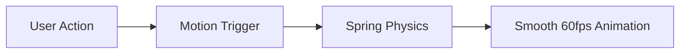
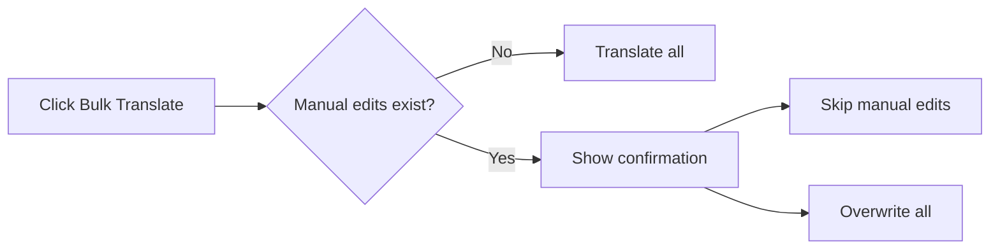

# Polish App with Safeguards & Animations

## Overview

This plan adds practical safeguards, improves performance, enhances visual indicators, and brings the app to life with smooth Motion (Framer Motion) animations throughout.

---

## 1. Animations with Motion (Framer Motion)

**Replace all existing CSS animations with Motion for:**

| Element | Animation |
|---------|-----------|
| Table rows | Staggered fade-in on load, smooth reorder on filter |
| Badges | Scale pop-in when status changes |
| Modals | Slide up + fade with spring physics |
| Buttons | Subtle scale on hover/tap |
| Progress bars | Smooth value transitions |
| Notifications | Slide in from edge, fade out |
| Tooltips | Quick fade + slight scale |
| Filter chips | Pill morphing when toggled |
| Empty states | Gentle bounce-in illustration |

**Motion features to use:**
- `AnimatePresence` for enter/exit animations
- `layout` prop for smooth reordering
- `spring` transitions for natural feel
- `stagger` for list animations
- `whileHover` / `whileTap` for micro-interactions

---

## 2. Protect Manual Edits from Bulk Translation

**Problem:** Bulk translation can accidentally overwrite carefully crafted manual translations.

**Solution:**
- Track which entries have been manually edited (not machine translated)
- Add a confirmation dialog when bulk translate would overwrite manual edits
- Show count of manual edits that would be affected
- Option to "Skip manually edited entries" during bulk translation

---

## 3. Confirmation for Risky Bulk Actions

**Add animated confirmation modals for:**
- Bulk translate when manual edits would be overwritten
- Loading a new file when current file has unsaved changes
- Clearing editor (improve existing)

Modals will slide up with spring animation and have animated button states.

---

## 4. Improve Empty and Error States

**Empty states with animations:**
- Welcome screen: Floating file icon with gentle bob animation
- No filter results: Fade in with suggested actions
- API key missing: Attention-grabbing but subtle pulse

**Error state improvements:**
- Slide-in error banners
- Shake animation for validation errors
- Smooth dismiss transitions

---

## 5. Performance for Large Files

**Optimizations:**
- Virtualized table rendering (only render visible rows)
- Memoize expensive computations
- Debounce filter/search inputs (300ms)
- Motion animations are GPU-accelerated, won't impact performance

---

## 6. Row Badges and Indicators

Animated badge system in the Status column:

| Badge | Color | Animation |
|-------|-------|-----------|
| Untranslated | Red | Static |
| Translated | Green | Pop-in when completed |
| Fuzzy | Yellow | Gentle pulse |
| Modified | Orange | Slide-in pill |
| MT | Blue | Scale pop |
| MT+G | Teal | Scale pop |
| Glossary | Purple dot | Fade in |

Badges animate on status change, not continuously (keeps UI calm).

---

## 7. Micro-interactions

**Subtle animations for polish:**
- Buttons: Scale 0.97 on press, 1.02 on hover
- Inputs: Border color transition on focus
- Checkboxes/Switches: Spring toggle animation
- Download indicator: Pulse when unsaved changes exist
- Row selection: Smooth background color transition

---

## Summary

| Area | Change |
|------|--------|
| Animations | Motion library throughout, spring physics |
| Safety | Protect manual edits, animated confirmations |
| UX | Animated empty states, smooth transitions |
| Performance | Virtualized table, GPU-accelerated animations |
| Visual | Animated badge system, micro-interactions |

The animations will be tasteful and purposeful - enhancing usability without being distracting. Everything uses spring physics for a natural, premium feel.